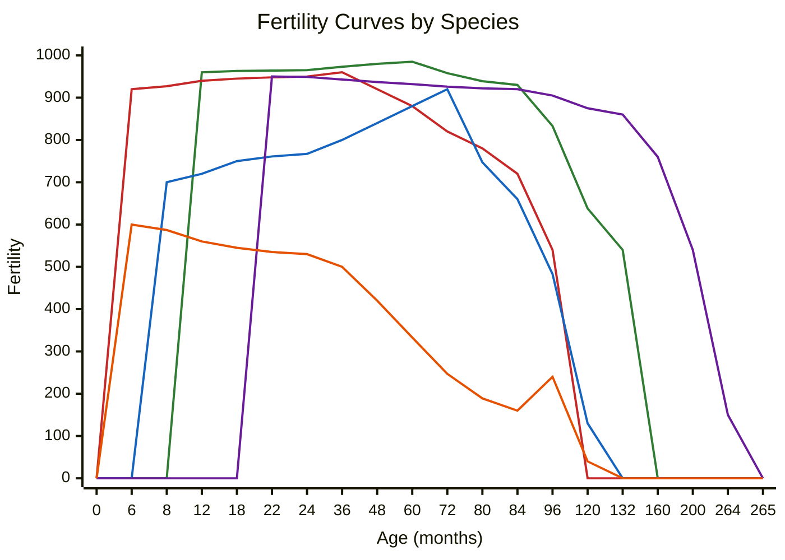

# Breeding

Enhanced Livestock introduces realistic breeding mechanics that require proper planning and animal management. Reproduction requires both male and female animals, supports natural mating and artificial insemination, and uses a Gaussian genetic inheritance model for offspring.

## Natural Breeding

### Male Animals Required

Unlike vanilla Farming Simulator, reproduction requires both male and female animals in the same husbandry:

- **Bulls** for cattle (Water Buffalo bulls only breed with Water Buffalo cows)
- **Boars** for pigs
- **Rams** for sheep (Goat rams only breed with goats)
- **Stallions** for horses
- **Roosters** for chickens

!!! note "Male Value"
    Male animals have higher market value compared to females due to their essential role in breeding.

!!! info "Breed Compatibility"
    Most breeds within the same species can interbreed freely. Exceptions are **Water Buffalo** (only breed with other Water Buffalo) and **Goats** (only breed with goat rams). Offspring have a 50% chance of inheriting the father's or mother's breed.

### Requirements for Natural Breeding

For a female to conceive naturally, she must meet all of the following conditions:

| Requirement | Details |
|-------------|---------|
| Gender | Female, not castrated |
| Minimum age | Species-specific (see fertility table below) |
| Health | At or above the subtype's minimum reproduction health threshold |
| Healthy weight | Required |
| Not pregnant | Must not be already pregnant |
| Recovery period | At least 2 months since last birth (or has never given birth) |
| Male present | An eligible, fertile male of the same species must be in the same husbandry |
| No inbreeding | The father of the female cannot be the male used for breeding |

Each day, eligible females are checked for natural conception. The system evaluates the animal's fertility genetics, applies disease modifiers, and uses the species fertility curve to determine if conception occurs.

### Male Fertility Limits

Males also have age-based fertility limits. A male cannot sire offspring beyond a maximum age:

| Animal | Maximum Male Fertility Age |
|--------|---------------------------|
| Cattle | 132 months (11 years) |
| Pigs | 48 months (4 years) |
| Sheep/Goats | 72 months (6 years) |
| Horses | 300 months (25 years) |
| Chickens | 1000 months |

The male's maximum fertility age is further scaled by his fertility genetics trait.

## Fertility Curves

Animals have age-dependent fertility curves defined per species. Fertility values determine the probability of successful conception at each age. A value of 0 means infertile, higher values mean greater chance of conception.

&#9644; Cattle &emsp;
&#9644; Pigs &emsp;
&#9644; Sheep & Goats &emsp;
&#9644; Horses &emsp;
&#9644; Chickens

## Pregnancy System

### Conception

When a female animal becomes pregnant (either naturally or via artificial insemination):

1. The number of offspring is determined using the species pregnancy curve and the mother's fertility genetics
2. Offspring genetics are calculated immediately using both parents' traits
3. Gender of each offspring is determined (50/50 for natural, or biased for sexed semen)
4. A gestation duration is assigned based on the species baseline with small random variation
5. An expected birth date is calculated

### Litter Sizes

Litter size is determined probabilistically based on species data and the mother's fertility genetics:

| Animal | Average Litter | Maximum Litter |
|--------|---------------|----------------|
| Cattle | 1 calf | 3 calves |
| Pigs | 12 piglets | 16 piglets |
| Sheep/Goats | 2 lambs/kids | 3 lambs/kids |
| Horses | 1 foal | 3 foals |
| Chickens | 5 chicks | 12 chicks |

Higher fertility genetics increase the chance of larger litters.

### Gestation Duration

Each pregnancy has an individual duration based on the species baseline. There is a rare (1%) chance of duration variation:

- A 5% sub-chance of +/- 2 months
- Otherwise +/- 1 month
- Duration is always clamped to a minimum of 2 months

### Freemartin Effect (Cattle Only)

When a cattle pregnancy produces both male and female calves in the same litter, there is a **97% chance** that each female calf will be born infertile (fertility genetics set to 0). This simulates the real-world freemartin condition where a female twin born alongside a male is usually sterile.

### Birth Complications

When the due date arrives, the following can occur:

- **Stillbirth** — Each offspring has a chance of being born dead, based on its health genetics and birth weight. Low health genetics or underweight calves are at higher risk.
- **Maternal death** — If any offspring die during birth, there is a chance the mother may also die. The probability is `1 - (0.35 + mother's health genetics * 1.25)`.
- **Overflow selling** — If the husbandry doesn't have enough free slots for all offspring, the least valuable offspring are automatically sold at market price.

### Lactation

After giving birth, cows and goats enter a **lactation period** lasting up to 10 months. During lactation:

- Food consumption increases by 25%
- Water consumption increases by 50%
- Weight gain is reduced to 75% of normal
- Milk production is active (for applicable species)

## Pregnancy Tracking

You can monitor pregnancies through the animal details screen:

- **Pregnancy status** — Whether the animal is pregnant and current progress
- **Expected offspring** — Number of babies expected
- **Due date** — When birth will occur
- **Reproduction progress** — Percentage through the gestation period

## Genetic Inheritance

Enhanced Livestock uses a **Gaussian (normal distribution) inheritance model** for offspring genetics. This system is based on the `BreedingMath` module.

### How It Works

For each of the five genetic traits (health, fertility, metabolism, productivity, quality):

1. The **mid-parent value** is calculated: `(mother + father) / 2`
2. A random value is drawn from a normal distribution centered on the mid-parent value
3. The standard deviation is 10% of the total genetic range (0.25–1.75), which equals **0.15**
4. The result is clamped to the valid range of **0.25 to 1.75**

This means offspring **can exceed or fall below both parents' values**, though most will land between them. Exceptional offspring (both better and worse than their parents) are possible but rare.

### Special Cases

- **Fertility**: There is a 0.1% chance an offspring is born completely infertile (fertility = 0), regardless of parent genetics
- **Productivity**: Only inherited for species that have the productivity trait (cattle, sheep, chickens). If the father has no productivity value, 1.0 is used as the default
- **Disease inheritance**: Diseases from both parents can affect offspring at conception through the disease system's `affectReproduction` mechanic

### Genetic Trait Range

| Rating | Value Range |
|--------|-------------|
| Extremely Low | 0.25 – 0.35 |
| Very Low | 0.35 – 0.70 |
| Low | 0.70 – 0.90 |
| Average | 0.90 – 1.10 |
| High | 1.10 – 1.40 |
| Very High | 1.40 – 1.65 |
| Extremely High | 1.65 – 1.75 |

## Artificial Insemination

Artificial insemination (AI) allows breeding without keeping male animals in the same husbandry. It uses the **Dewar system** to store and manage semen straws.

### Dewar System

A **Dewar** is a physical in-game object (a small cryogenic container) that stores semen straws from a specific sire (male animal). Dewars are:

- Purchasable from the animal dealer
- Pickable and transportable (can be carried or placed on trailers)
- Linked to a specific sire with full pedigree and genetics information
- Managed per-farm by the `DewarManager`

#### Dewar Properties

| Property | Details |
|----------|---------|
| Straw capacity | Up to 1,000 straws per dewar |
| Price per straw | $0.85 |
| Nitrogen level | 0–100%, degrades over time |
| Degradation rate | 1% per day |

#### Nitrogen Management

Dewars require liquid nitrogen to keep semen viable:

- Nitrogen level starts at 100% and **decreases by 1% per day**
- When nitrogen reaches **0%**, the dewar and all its straws are **destroyed** (spoiled) with a critical in-game notification
- You can **refill nitrogen** by walking up to a dewar and using the refill action
- Refill cost: **$50** per refill (restores to 100%)
- A warning is shown when nitrogen drops below 20%, and a critical warning below 5%

!!! warning "Dewar Spoilage"
    Keep your dewars topped up with nitrogen! If the nitrogen level reaches 0%, all semen straws are permanently lost. Check on your dewars regularly.

### Semen Types

Three types of semen are available, affecting offspring gender probability:

| Semen Type | Gender Outcome |
|-----------|----------------|
| **Conventional** | 50% male, 50% female (natural odds) |
| **Sexed Female** | 90% female, 10% male |
| **Sexed Male** | 90% male, 10% female |

Sexed semen allows targeted breeding programs to produce predominantly one gender.

### Manual Insemination (Hand Tool)

To manually inseminate an animal:

1. **Take a straw** from a dewar — this gives you the AI Straw hand tool
2. **Walk up to an eligible female** in a husbandry — a prompt will appear
3. **Press the action button** to inseminate the animal
4. The straw is consumed after use (whether the insemination succeeds or not)

The hand tool shows genetic information about the sire when held. If the targeted animal cannot be inseminated, an error message explains why (see validation rules below).

!!! tip "Returning Unused Straws"
    If you change your mind, you can **return an unused straw** to its original dewar by walking up to the dewar and pressing the return action. The straw will be added back to the dewar's count.

### Insemination Validation

An animal **cannot** be inseminated if any of the following conditions apply:

| Condition | Error |
|-----------|-------|
| Animal is male | Males cannot be inseminated |
| Already pregnant | Animal is already pregnant |
| Wrong species | Semen must match the animal's species |
| Already inseminated | Animal is already awaiting insemination results |
| Too young | Animal has not reached minimum reproduction age |
| Recently gave birth | Must wait at least 2 months after giving birth |
| Sire is the animal's father | Cannot use semen from the animal's own father |

### Insemination Success

After insemination, the outcome is evaluated on the next day change. Success depends on:

1. **Mother's fertility genetics** — Higher fertility increases success chance
2. **Disease modifiers** — Active diseases with fertility modifiers reduce success
3. **Sire's success rate** — Each sire has a success rating stored in the dewar
4. **Random variation** — The sire's success rate is multiplied by a random factor between 80% and 120%

If successful, pregnancy proceeds exactly as with natural breeding. If unsuccessful, the straw is still consumed and a failure notification is shown.

### Dewar Info Display

When looking at a dewar, the following information is shown:

- Number of straws remaining
- Sire's average success rate
- Species and breed
- Sire's name and ear tag
- Nitrogen level (with color-coded warning)
- Full genetics breakdown of the sire

## AI Herdsman Insemination

The [AI Herdsman](ai-herdsman.md) can automate insemination as part of its monthly management cycle.

### How It Works

1. The herdsman checks which dewars are available for the farm
2. You can configure a **specific dewar** or allow the herdsman to use **any available dewar**
3. The herdsman filters eligible females based on your configured criteria:
    - Age range
    - Genetics ranges (metabolism, quality, fertility, health, productivity)
    - Disease status
4. Eligible animals are **sorted by total genetics score** (sum of all traits), prioritizing the best animals
5. The herdsman inseminates up to the configured **maximum number of animals per month**
6. Each insemination consumes one straw from the selected dewar

### Mark Mode

The herdsman can operate in two modes:

- **Execute mode** — Automatically inseminates the selected animals
- **Mark mode** — Only marks animals that would be inseminated (for your review), without actually performing the insemination. This incurs a reduced wage cost.

### Herdsman Costs

The herdsman charges wages based on:

- Number of animals actually inseminated
- Number of animals evaluated (even if not inseminated)
- Whether mark mode or execute mode is used (mark mode costs less)

## Breeding Tips

!!! tip "Successful Breeding Program"
    1. **Maintain male-to-female ratios** — Ensure adequate males for your herd size
    2. **Select for desired traits** — Choose breeding pairs with complementary genetics. The Gaussian model means offspring average between parents but can exceed them
    3. **Monitor health** — Keep animals healthy to maximize fertility and reduce disease-related fertility penalties
    4. **Use sexed semen strategically** — Use sexed female semen for dairy herds to maximize milk-producing cows, or sexed male semen for meat operations
    5. **Age management** — Breed animals during their peak fertility years (check the species-specific curves above)
    6. **Watch for freemartins** — In cattle, mixed-gender litters will likely produce infertile females. Consider using sexed semen to avoid this
    7. **Keep dewars topped up** — Nitrogen degrades daily. Set a reminder to refill dewars before they spoil
    8. **Use the AI Herdsman** — For large herds, automate insemination with configured genetics filters to consistently improve your stock
    9. **Track lineage** — Avoid inbreeding by monitoring family trees. The system prevents father-daughter breeding automatically
